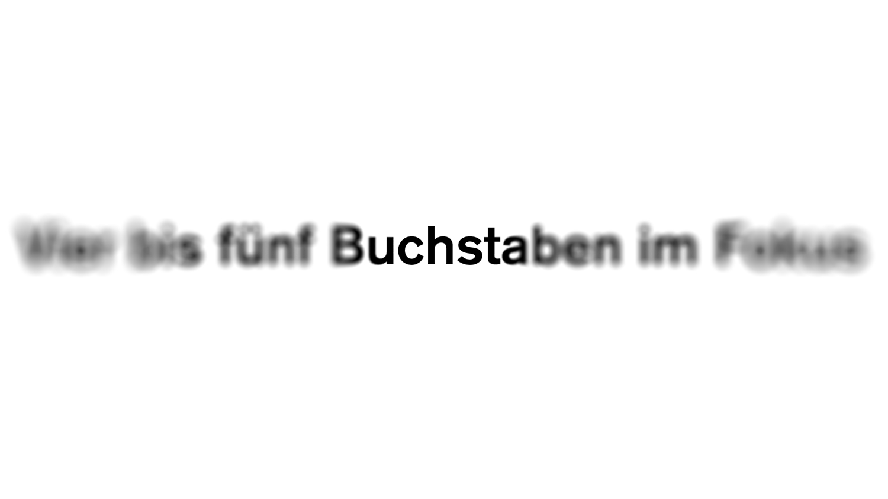
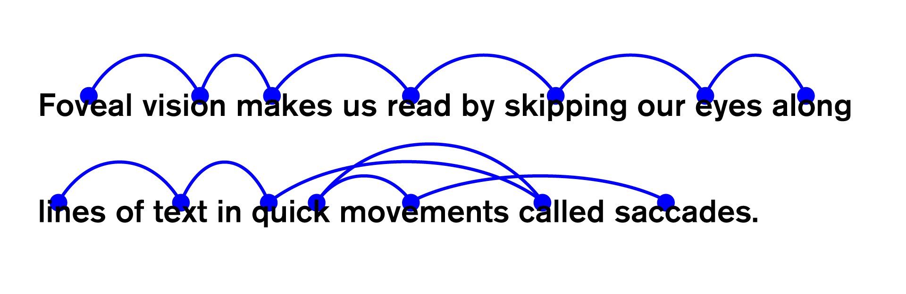
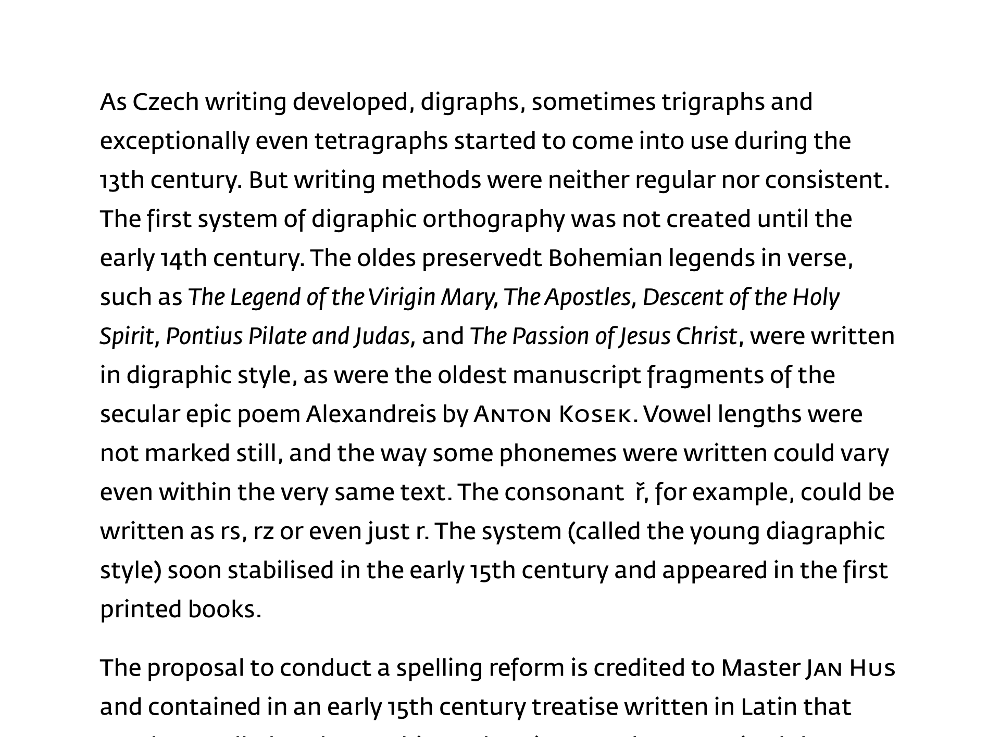
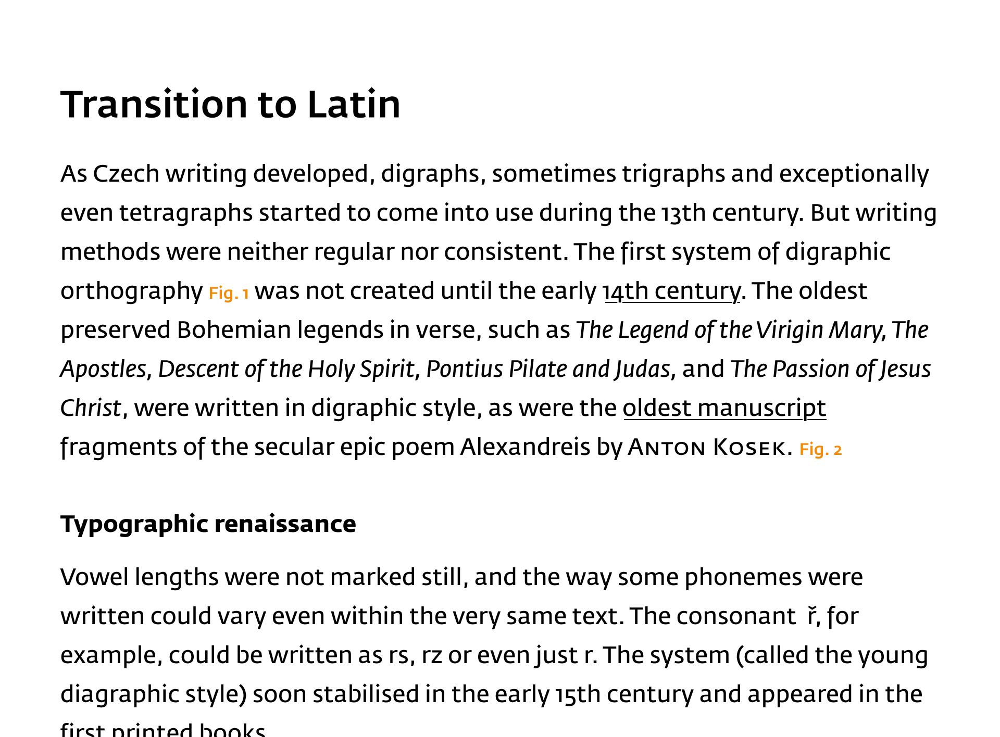
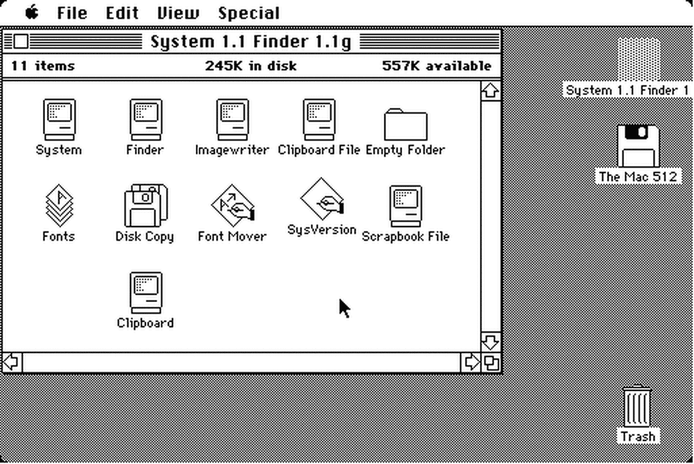
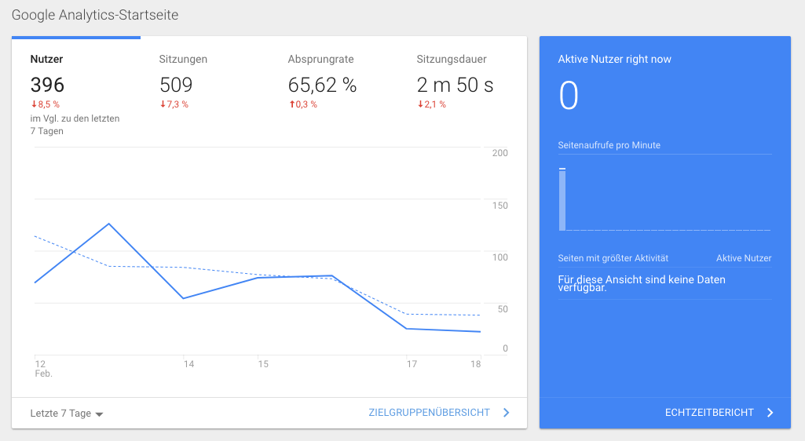
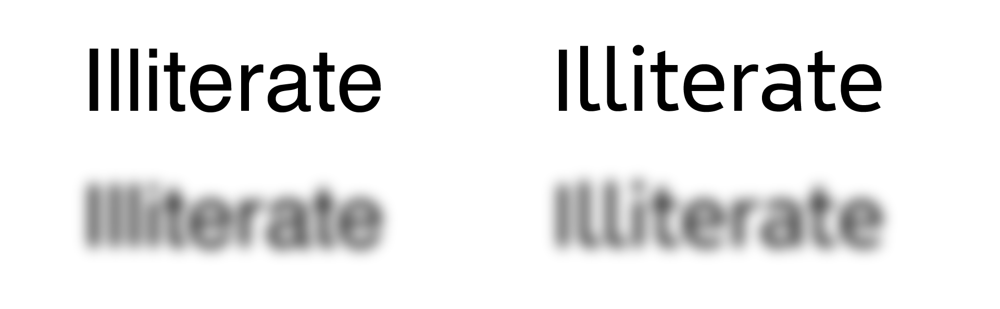

Ob analog oder digital, das Ziel der Typografie bleibt unverändert: Eine dem Nutzer und der Lesesituation angemessene Informationsvermittlung erreichen.

## Typografie
Ziel der Typografie ist die Vermittlung von Information mittels des Mediums Schrift. Typografie ist stark von den Zielen des zu gestaltenden Artefakts und der Lesesituation des Rezipienten abhängig: Auf einem Autobahnschild, dass auch bei 200 km/h Fahrgeschwindigkeit angemessen lesbar sein muss wird anders mit Schrift umgegangen, als in einem Roman, den man abends auf der Couch liest.

In ihrem Ziel unterscheidet sich die digitale Typografie nicht von der analogen. Es geht auch in der digitalen Welt um die angemessene Vermittlung textlicher Inhalte. Makro- und mikrotypografische Entscheidungen, die einer bestimmten Situation »angemessen« ist, hängt von vielen Faktoren ab, wie z.B. der Lesesituation des Nutzers, der vermutlichen Leseart, der Art der darzustellenden Information und nicht zuletzt auch der Lesemotivation des Nutzers, um nur ein paar Beispiele zu nennen.

Auch wenn die digitale Welt mit Videos, Livestreams, Augmented und Virtual Reality immer multimedialer wird, so liegen die meisten Informationen immer noch in schriftlicher Form vor: Sei es in Form eines langes prosaischen Textes, oder in Form eines kleinen Labels, dass mich über die Funktion eines Buttons auf einer Website informiert. Gute Typografie hat nichts an Wichtigkeit verloren.

## Schrift soll gelesen werden
Ziel der Typografie ist es, eine einladende und angenehme Leseerfahrung für den Betrachter zu ermöglichen. Was sich leicht liest, wird gerne gelesen. So kann Typografie dazu beitragen, ein digitales Produkt oder eine Website in guter Erinnerung zu behalten. Dazu müssen wir aber zunächst wissen, wie wir eigentlich lesen.

### Lesen: Wie funktioniert das?
Wie wir im nächsten Abschnitt sehen werden, gibt es verschiedene Arten des Lesens. Um zu verstehen, wie unsere Wahrnehmung uns das Lesen ermöglicht wollen wir hier zunächst einen Blick auf das Erkennen einzelner Worte und das durchgängige Lesen eines längeren Textblocks (sogenanntes »lineares Lesen« bspw. in einem Roman oder einem spannenden Blogpost) werfen.

#### Wie wir Worte lesen
TODO

#### Wie wir lineare Texte lesen
Ein linearer Lesetext kann auf verschiedene Arten angegangen werden. Häufig überfliegt ein Leser den Text zunächst, um einen Eindruck von dessen Inhalt zu bekommen oder gezielt nach einer Information zu suchen. Hat ein Leser eine interessante Stelle gefunden verlangsamt sich das Lesetempo und der Text wird aufmerksam gelesen. Der Leser versinkt im Text, blendet nach und nach seine Umwelt aus und merkt nicht, wie die Zeit verfliegt, während die Worte ihn in ihren Bann ziehen.

Jedoch werden lineare Texte nicht glatt und linear gelesen. Unsere Augen können immer nur einen winzigen Bereich gleichzeitig in voller Schärfe wahrnehmen. Alles außerhalb dieses Bereichs nehmen wir unscharf wahr. Diesen Bereich der Schärfe nennt man auch »foveales Sehen«, den unscharfen Bereich außen herum bezeichnet man als »peripheres Sehen«. Aufgrund des kleinen Bereich des fovealen Sehens können unsere Augen nur einige Buchstaben gleichzeitig scharf wahrnehmen.

Anstatt also glatt und linear Wort für Wort über den Text zu gleiten, springen unsere Augen hin und her um den Punkt des fovealen Sehens zu verschieben. Diese Sprünge nennt man Sakkaden. Zwischen einzelnen Sakkaden bleiben unsere Augen lange genug an einer Stelle, um die Buchstaben im Bereich des scharfen Sehens zu erkennen und anhand der Informationen aus dem peripheren Sehen die nächste Sakkade zu planen – das nennt man auch »Fixierung«. Diese Sakkaden gehen nicht von Wort zu Wort, sondern springen vor (und manchmal auch zurück), während unser Gehirn das gelesene entschlüsselt.

Sobald unser Gehirn eine Buchstabengruppe erkannt hat, bewegen wir unsere Augen weiter. Während wir weiterlesen setzt unser Gehirn die gesehen Buchstaben zu Worten und Worte zu Sätzen zusammen. Aufgrund unserer Lese- und Spracherfahrung rät unser Gehirn manchmal, wie ein Satz weitergehen wird und schickt unsere Augen dann in einer Rückwärtssakkade noch einmal zur Überprüfung zurück. Wenn wir das Ende eine Zeile erreicht haben lösen unsere Augen sich vom Text und springen in einer großen Sakkade zum Beginn der nächsten Zeile.

Bei geübten Lesern laufen diese Prozesse so schnell ab, dass sie nicht bewusst wahrgenommen werden. Die Dauer der Fixierungen kann jedoch unterschiedlich sein und hängen davon ab, wie geübt ein Leser ist und wie vertraut er mit dem Thema des Textes ist. Auch typografische Entscheidungen wie Wahl der Schriftart, Laufweite, Zeilenhöhe und Zeilenlänge beeinflussen die Lesegeschwindigkeit.

### Lesesituation und Arten des Lesens
Da eine umfassende Erörterung in die angemessene Gestaltung für die verschiedenen Lesearten den Umfang dieser Einführung sprengen würde, sei hier auf das Buch »Lesetypografie« von Hans Peter Willberg und Friedrich Forssman verwiesen. Auch wenn es in dem Buch vor allem um analoge Typografie geht, lassen sich fast alle Empfehlungen unverändert auf digitale Typografie anwenden. Im Folgenden soll kurz auf die drei häufigsten Lesearten in der digitalen Typografie eingangen werden.

#### 1. Lineares Lesen
Unter linearem Lesen versteht man die »klassische Art« des Lesens, bei der eines nach dem anderen gelesen wird. Das Lesen geschieht bei dieser Leseart zumeist freiwillig, analoger Prototyp sind prosaische Texte, als digitaler Prototyp können lange Artikel und Blogeinträge gelten, die der Lesen am Stück lesen möchte.

Um einen Text für das lineare Lesen zu gestalten, ist es wichtig die Augen des Lesers bei den Sakkaden so gut wie möglich zu unterstützen und unnötige Rückwärtssakkaden zu vermeiden. Bei der Schriftwahl ist darauf zu achten, dass die Schrift nicht allzu detailreich ist, um nicht zu viel Aufmerksamkeit vom Text abzulenken. Zudem sollte die Schrift über gut gemachtes Spacing und Kerning verfügen, damit sich ein gleichmäßiger Grauwert für einen gesamten Text ergibt. Dieser gleichmäßige Grauwert hilft dem Auge bei der Planung weiterer Sakkaden im peripheren Sehen. Eine Schriftart mit ungewöhnlichen Details könnte diese periphere Wahrnehmung stören und zu kleinen Sakkaden und häufigeren Rückwärtssprüngen führen. Zum Testen kann man hier einen längeren Absatz in Zielschrift und Zielschriftgröße setzen, diesen digital auf den Kopf stellen und dann schauen, ob sich helle oder dunkle Flecken im Schriftbild ergeben. Bei einer guten Textschrift sollte das Schriftbild ein nahezu einheitliches Grau aufweisen.

Bei dieser Art des Lesens geht es darum, eine möglichst angenehme ermüdungsfreie Leseatmosphäre zu schaffen, bei ohne viel Anstrengung Zeile um Zeile gelesen werden. Aus dem linearen Lesen haben sich die klassischen Regeln der Buchtypografie ergeben, von denen sich einige auf im digitalen Anwenden lassen. Es empfiehlt sich, die einzelnen Zeilen des Textes mit 60–70 Zeichen pro Zeile auf eine angenehme Länge zu bringen und den Zeilenabstand so zu wählen, dass das Auge vom Ende der einen mühelos zum Beginn der nächsten Zeile springen kann. Für einen »durchschnittlichen« Desktop-Bildschirm hat sich eine 1.5-fache Zeilenhöhe als guter Startwert erwiesen. Die Größe der Schrift ist groß genug zu wählen, dass sie mühelos erkennbar nicht, aber nicht zu groß, da sonst nur sehr wenige Zeilen Text auf den Bildschirm passen, bevor der Nutzer scrollen muss und das Auge erneut den Zeilenanfang suchen muss. Hier haben sich – je nach verwendeter Schrift – 16–18px (beim »durchschnittlichen« Desktop-Bildschirm) als guter Startwert erwiesen.

Im allgemeinen geht man jedoch davon aus, dass niemand gerne lange Texte am Bildschirm liest und diese darum zu vermeiden sind. Im Internet – so die Usability-Forschung – ist die menschliche Aufmerksamkeitsspanne besonders kurz. Dieser Einwand mag sicherlich seine Berechtigung haben und nur, weil man die Mittel hat, um einen langen Text angenehm zu präsentieren, heißt das nicht, dass lange Texte sich für jede Website eignen – gerade, wenn es dem Nutzer nur darum geht, schnell gezielte Informationen zu erhalten.

Lineares Lesen ist darum sicherlich nicht die häufigste Art des Lesens am Bildschirm, aber sie ist auf keinen Fall pauschal auszuschließen. Gelungene Artikel-Gestaltungen wie [Works that Work](https://worksthatwork.com/) oder [De Correspondent](https://decorrespondent.nl/) zeigen, dass lineares Lesen am Bildschirm ganz wunderbar funktionieren kann.

> Beim linearen Lesen ist es Ziel der Typografie, den Leser nicht zu stören.

#### 2. Konsultierendes Lesen
Ziel des konsultierenden Lesens ist das schnelle Auffinden einer Information im Text, als analoger Prototyp mag das Lexikon gelten, als digitaler (wenngleich typografisch schlecht gelöst) Prototyp kann ein Wikipedia-Eintrag verstanden werden.

Auch das konsultierende Lesen geschieht meistens freiwillig, kann jedoch unter einem nicht unerheblichen Zeitdruck stattfinden.

Das konsultierende Lesen unterscheidet sich vom linearen Lesen dadurch, dass mit großer Wahrscheinlichkeit nicht der gesamte Text gelesen wird, sondern nur die Passage oder der Absatz, der die gesuchte Information enthält.

Die Typografie für konsultierendes Lesen kann also lebhaft sein (beim linearen Lesen würde das stören), um dem Leser eine klare Gliederung des Textes und deutliche Auszeichnungen innerhalb des Textes präsentieren zu können.

Da hier nicht Zeile für Zeile gelesen wird dürfen die Zeilen etwas länger werden, da man so mehr Information auf einen Blick präsentieren kann. Deutlich mehr als 80 Zeichen pro Zeile sollten es jedoch auch hier nicht sein. Um mehr Informationen zeigen zu können, kann man auch mit einem kleineren Schriftgrad experimentieren. Hier muss man jedoch darauf achten, dass der Text gut erkennbar bleibt.

Für das konsultierende Lesen empfehlen sich gut ausgebaute Schriftfamilien mit verschiedenen Gewichten und Weiten, die dem Gestalter gute Möglichkeiten zur optischen Gliederung des Textes an die Hand geben.

> So deutlich wie nötig: Den Leser schnell zu seiner gesuchten Information zu führen. So zurückgenommen wie möglich: Den Leser nicht im Leseprozess stören, sobald er die gesuchte Information gefunden hat.

#### 3. Selektierendes Lesen
Beim selektierenden Lesen ist die Typografie in verschiedene Ebene gegliedert, die miteinander in Verbindung stehen oder unabhängig voneinander gelesen werden können. Bei vielen digitalen Produkten handelt es sich um selektierendes Lesen, da Nutzer häufig nur, die für sie relevanten Blöcke lesen und die Darstellungen häufig in verschiedene Bereiche geteilt ist (bspw. Sidebar, Header, Footer oder verschiedene Widgets auf einem Dashboard), die unabhängig voneinander betrachtet werden können. Analoger Prototyp ist das Kochbuch, digitaler Prototyp kann das Dashboard einer Web-Applikation sein.

Beim selektierenden Lesen kann man nicht mehr von der generellen Lese-Freiwiligkeit des Lesers ausgehen. Lesen ist hier Mittel zum Zweck.

Viele graphische User Interfaces sind dieser Leseart zuzuordnen. Häufig bestehen Sie aus kleinen Textbausteinen (manchmal sogar nur einzelne Wörter), die durch ihre Hierarchie den Sinn des Interfaces ausmachen.

Dementsprechend sollte besonders hohe Leserlichkeit geboten werden. Dem Gestalter steht hier das gesamte typografische Arsenal zur Verfügung, um verschiedenartige Inhalte semantisch klar zu präsentieren. Hier muss man jedoch aufpassen, dass man die Gestaltung nicht überstrapaziert und so nur Verwirrung stiftet.

> Text ist User Interface.

Hier eignen sich Schriften, die gut ausgebaut sind, deutlich unterscheidbare Buchstabenformen bieten und mitunter gar speziell für den Bildschirm entworfen wurden (da man mit diesen Schriften in der Regel auch noch gute Lesbarkeit in kleinen Graden erreichen kann, wenn man bspw. tabellarische Daten platzsparend darstellen muss). Anders als bei den linearen Lesearten geht es hier vor allem darum eine gute Leserlichkeit der einzelnen Worte zu bieten. Wir erinnern uns daran, dass wir einzelne Worte vor allem anhand der Unterscheidungsmerkmale einzelner Buchstaben erkennen. Für das selektierende Lesen in Benutzerinterfaces empfehlen sich daher Schriften, die Unterschiede zwischen den Buchstaben besonders hervorheben und Buchstabenverwechselungen vermeiden.

Die Grafik zeigt, dass in Helvetica (links) einige beispielsweise das große I optisch nur schwer vom kleinen L zu unterscheiden ist. Appeltje (rechts) hingegen bietet eindeutigere Buchstabenformen. Es fällt durch die Weichzeichnung zudem auf, dass die geschlossenen Formen der Helvetica schnell zulaufen und so in kleinen Graden (oder falls der Leser seine Lesebrille mal nicht zur Hand hat) schnell unkenntlich werden. Appeltje hingegen arbeitet mit offeneren Formen (vor allem beim kleinen E und A erkennbar) und bleibt so auch bei Unschärfe noch etwas länger erkennbar.

> Ziel des Typografie für selektierendes Lesen ist es, so deutlich wie möglich zu sein, ohne den Leser zu verwirren oder zu überfordern.

#### Mischformen
Die vorgestellten Lesearten müssen natürlich nicht zwingend in ihrer Reinform vorkommen. Häufig findet man in der digitalen Welt auch Mischformen, bei einem Blogartikel bspw. wird der Artikel im Modus des __konsultierenden Lesens__ gelesen, wohingegen das Gesamtlayout den Regeln des __selektierenden Lesens__ folgen muss um bspw. andere Seitenelement wie Header oder Sidebar vom Inhalt des Artikels abzugrenzen.
